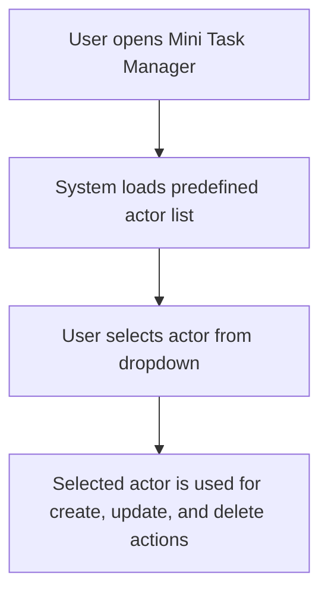
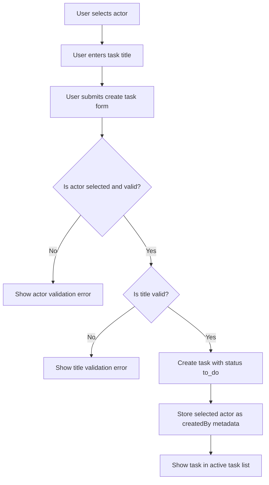
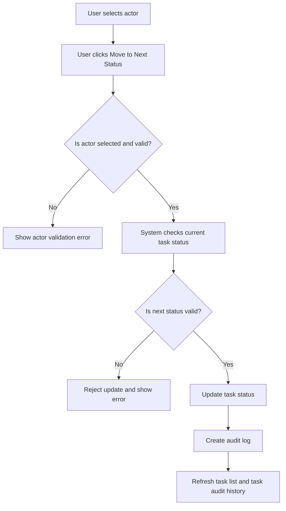
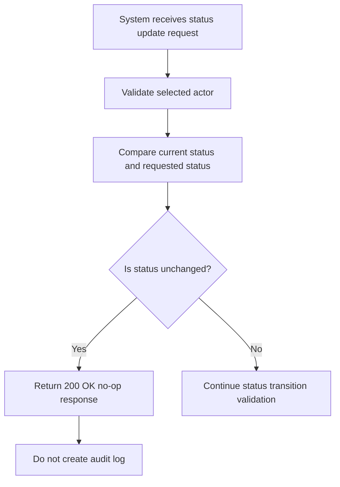
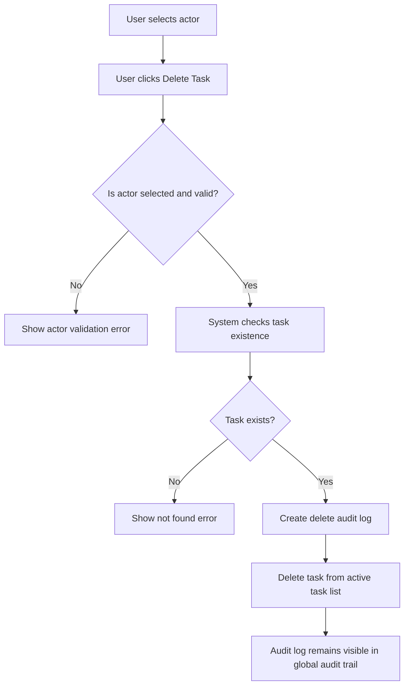
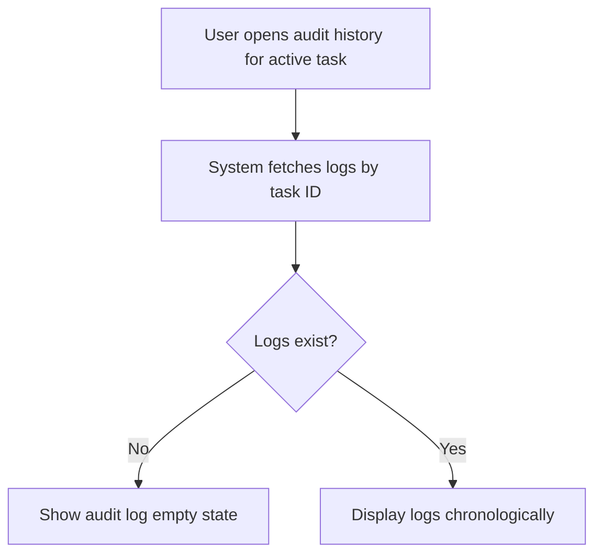
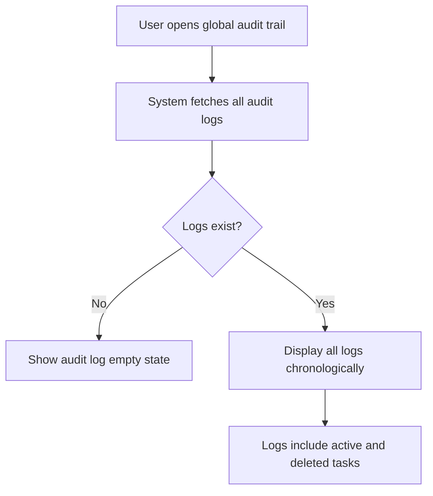

# Product Requirements Document (PRD)
# Mini Task Manager with Audit Log

## 1. Document Information

| Field | Value |
|---|---|
| Product Name | Mini Task Manager with Audit Log |
| Document Type | Product Requirements Document |
| Version | 1.1 |
| Target Role | Full Stack Developer Take-Home Task |
| Frontend Stack | React + TypeScript |
| Backend Stack | Node.js + Express + TypeScript |
| Persistence | JSON File |
| Scope | Take-home assessment, not production-grade system |

---

## 2. Overview

Mini Task Manager with Audit Log is a simple internal task management application that allows team members to create tasks, update task statuses, delete tasks, and review audit history.

The main focus of this application is traceability. Every meaningful change to a task must be clearly recorded so the team can understand what changed, who performed the change, and when the change happened.

Because authentication is out of scope, the system uses a predefined actor list. A user selects an actor from the UI before creating a task, updating task status, or deleting a task. The selected actor is used as task creator metadata and audit log actor metadata.

This product intentionally keeps the feature set small. The goal is to demonstrate clear product thinking, consistent business rules, clean full stack implementation, and understandable technical trade-offs.

---

## 3. Product Context

Internal teams often use task management tools to coordinate work. However, when task statuses change frequently, it can become difficult to answer basic questions such as:

- Who created this task?
- Who changed this task?
- What was the previous status?
- What is the current status?
- When did the change happen?
- Was this task deleted, and by whom?

The requested solution is a simple task manager that makes task creation, status changes, and deletion actions easier to trace.

The application should prioritize clarity, consistency, and maintainability over visual complexity or unnecessary features.

---

## 4. Problem Statement

The internal team has a task management process where task changes are not clearly traceable.

The main problems are:

1. Task status often changes without clear history.
2. It is difficult to know who changed a task.
3. It is difficult to know the previous and new status of a task.
4. It is difficult to know who created a task when authentication is not available.
5. Deleted tasks may lose important context if no audit history is preserved.
6. The UI does not clearly show the history of task changes.
7. Invalid status transitions can make task data inconsistent.
8. Repeated same-status updates can create misleading duplicate audit logs if not handled properly.

The system must provide a simple way to manage tasks while keeping important task metadata and changes traceable.

---

## 5. Goals

The goals of this product are:

1. Allow users to create tasks.
2. Store the selected actor as the creator metadata when a task is created.
3. Allow users to view all active tasks.
4. Allow users to delete tasks.
5. Allow users to move a task to the next valid status.
6. Enforce the valid status flow: `to_do → pending → in_progress → done`.
7. Reject invalid, skipped, or backward status transitions.
8. Treat same-status updates as idempotent no-op operations.
9. Create an audit log for every valid task status change.
10. Create an audit log when a task is deleted.
11. Display audit logs per active task.
12. Display a global audit trail so logs from deleted tasks can still be viewed.
13. Prevent audit logs from being modified or deleted.
14. Store data using JSON file persistence.
15. Keep the application simple and easy to run locally.
16. Provide clear documentation for setup, assumptions, trade-offs, and future improvements.

---

## 6. Non-Goals

The following items are intentionally out of scope:

1. Authentication.
2. Authorization or role-based access control.
3. Session-based user identity.
4. Real-time collaboration.
5. WebSocket-based updates.
6. Task assignment.
7. Task comments.
8. Task editing after creation. *(Amended: simple title/description editing of active tasks is now in scope via `PATCH /api/tasks/:taskId`. See §13.8 below. Status cannot be edited through this endpoint, and edits do not create audit log entries.)*
9. File attachments.
10. Notification system.
11. Search and advanced filtering.
12. Pagination.
13. Complex dashboard analytics.
14. Multi-tenant organization support.
15. Production-grade concurrency control.
16. Deployment to cloud infrastructure.
17. Complex UI animation or advanced visual design.

These items are excluded to keep the solution focused on the core assessment requirements: task management, status validation, audit logging, data consistency, and clear reasoning.

---

## 7. Target Users and Actor Model

The target users are internal team members who need to manage simple tasks and review the history of task changes.

Because authentication is out of scope, user identity is represented by a predefined actor list. The actor is selected manually from the UI before performing actions that need identity metadata.

The actor model is used for:

1. `createdBy` metadata when creating a task.
2. Audit log actor metadata when updating task status.
3. Audit log actor metadata when deleting a task.

Example predefined actors:

| Actor ID | Display Name |
|---|---|
| john.doe | John Doe |
| jane.smith | Jane Smith |
| admin.user | Admin User |

Important note:

The selected actor is not the same as an authenticated user. The system does not verify identity through login, session, token, or password. This is an intentional trade-off because authentication is out of scope for this take-home task.

---

## 8. Core Product Scope

The product consists of the following main modules:

1. Task Management
2. Status Management
3. Actor Management
4. Audit Log
5. Error and Empty State Handling

---

## 9. Module and Feature Breakdown

| No | Module | Sub Module | Action / Feature | Priority | Notes |
|---:|---|---|---|---|---|
| 1 | Task Management | Task List | View all active tasks | High | Main page for active task management |
| 2 | Task Management | Create Task | Create a new task | High | New task starts with `to_do` status |
| 3 | Task Management | Create Task | Store selected actor as task creator | High | Saves `createdByActorId` and `createdByActorName` |
| 4 | Task Management | Delete Task | Delete an existing task | High | Delete action must create an audit log |
| 5 | Task Management | Delete Task | Remove deleted task from active task list | High | Deleted task should no longer appear in active tasks |
| 6 | Status Management | Status Flow | Move task to the next valid status | High | Uses a `Move to next status` action |
| 7 | Status Management | Status Validation | Prevent skipped status transition | High | Example: `to_do → in_progress` is invalid |
| 8 | Status Management | Status Validation | Prevent backward status transition | High | Example: `in_progress → pending` is invalid |
| 9 | Status Management | Status Validation | Prevent status change after `done` | High | `done` is treated as the final status |
| 10 | Status Management | Idempotent Update | Handle same-status update as no-op | High | Returns success but does not create a new audit log |
| 11 | Actor Management | Actor Selection | Select actor before creating task | High | Actor is required for `createdBy` metadata |
| 12 | Actor Management | Actor Selection | Select actor before status update | High | Actor is required for status audit log |
| 13 | Actor Management | Actor Selection | Select actor before deleting task | High | Actor is required for delete audit log |
| 14 | Actor Management | Predefined Actors | Provide predefined actor list | High | No authentication required |
| 15 | Actor Management | Actor Validation | Validate selected actor in backend | High | Prevents unknown actor IDs from being stored |
| 16 | Audit Log | Status Change Log | Create audit log when task status changes | High | Records actor, task, old status, new status, timestamp |
| 17 | Audit Log | Delete Log | Create audit log when task is deleted | High | Records actor, task, last status, and timestamp |
| 18 | Audit Log | Task Audit History | View audit logs per active task | High | Can be shown in expandable section, modal, or detail panel |
| 19 | Audit Log | Global Audit Trail | View all audit logs including deleted tasks | High | Needed so deleted task logs remain visible in UI |
| 20 | Audit Log | Chronological Ordering | Display audit logs chronologically | High | Oldest to newest |
| 21 | Audit Log | Immutability | Prevent audit log update and delete | High | No edit/delete audit log feature |
| 22 | Error Handling | Validation Error | Show clear error for invalid status transition | Medium | Error should be understandable from UI |
| 23 | Error Handling | Actor Error | Show clear error when actor is missing or invalid | Medium | Applies to create, update, and delete actions |
| 24 | Error Handling | Not Found Error | Show clear error when task does not exist | Medium | Applies to update, delete, and audit log fetch |
| 25 | Empty State | Task Empty State | Show empty state when there are no active tasks | Medium | Keeps UI clear |
| 26 | Empty State | Audit Log Empty State | Show empty state when a task has no audit logs | Medium | Useful for newly created tasks |

---

## 10. Task Status Flow

The system supports the following task statuses:

| Status | Description |
|---|---|
| `to_do` | Task has been created but not started |
| `pending` | Task is waiting or queued for work |
| `in_progress` | Task is currently being worked on |
| `done` | Task has been completed |

Valid status flow:

```txt
to_do → pending → in_progress → done
```

Allowed transitions:

| From | To | Allowed |
|---|---|---|
| `to_do` | `pending` | Yes |
| `pending` | `in_progress` | Yes |
| `in_progress` | `done` | Yes |

Invalid transition examples:

| From | To | Reason |
|---|---|---|
| `to_do` | `in_progress` | Skips `pending` |
| `to_do` | `done` | Skips required statuses |
| `pending` | `to_do` | Backward transition |
| `in_progress` | `pending` | Backward transition |
| `done` | `in_progress` | `done` is final |
| `done` | `pending` | `done` is final |

---

## 11. Product Flows

### 11.1 Actor Selection Flow



### 11.2 Create Task Flow



### 11.3 Update Task Status Flow



### 11.4 Same-Status Update Flow



### 11.5 Delete Task Flow



### 11.6 View Task Audit History Flow



### 11.7 View Global Audit Trail Flow



---

## 12. Business Rules

### 12.1 Task Rules

1. A task must have a non-empty title.
2. A task title should be trimmed before saving.
3. A newly created task must start with `to_do` status.
4. Creating a task requires a valid actor.
5. The selected actor must be stored as task creator metadata.
6. A task can be deleted.
7. Deleting a task requires a valid actor.
8. Deleted tasks must be removed from the active task list.
9. Deleting a task must create an audit log.
10. Deleting a task must not delete previous audit logs.
11. Task creation does not create an audit log because `createdBy` metadata already stores the creator information and the requested audit focus is status change and deletion tracking.

### 12.2 Status Rules

1. A task can only move forward by one status step.
2. The valid status flow is `to_do → pending → in_progress → done`.
3. Skipped transitions are not allowed.
4. Backward transitions are not allowed.
5. `done` is the final status.
6. Same-status update returns `200 OK` as a no-op.
7. Same-status update must not create a new audit log.
8. Backend validation is mandatory for every status update.
9. Frontend validation is optional and only used to improve user experience.
10. Updating task status requires a valid actor.

### 12.3 Actor Rules

1. Actor data is predefined.
2. Actor selection is required before task creation.
3. Actor selection is required before status update.
4. Actor selection is required before task deletion.
5. Actor identity is not authenticated in this version.
6. Backend must validate that the submitted actor ID exists in the predefined actor list.
7. The selected actor is stored as a snapshot in task creator metadata.
8. The selected actor is stored as a snapshot in audit logs.
9. The actor snapshot should include both actor ID and actor display name.

### 12.4 Audit Log Rules

1. Audit logs are append-only records.
2. Audit logs must be created for valid status changes.
3. Audit logs must be created for task deletion.
4. Audit logs are not created for task creation.
5. Audit logs must include enough information to remain understandable after task deletion.
6. Audit logs must not be updated.
7. Audit logs must not be deleted.
8. Audit logs must remain visible even if the related task has been deleted.
9. Audit logs must be displayed chronologically.
10. Updating a task must not remove old audit logs.
11. Deleting a task must not remove old audit logs.

---

## 13. Functional Requirements

### 13.1 Select Actor

Users can select an actor from a predefined list.

Acceptance criteria:

1. User can view predefined actors.
2. User can select one actor.
3. Selected actor is used for task creation.
4. Selected actor is used for status update audit logs.
5. Selected actor is used for delete audit logs.
6. Backend rejects create, update, or delete actions if the actor is missing.
7. Backend rejects create, update, or delete actions if the actor ID does not exist in the predefined actor list.

---

### 13.2 Create Task

Users can create a new task by selecting an actor and entering a task title.

Acceptance criteria:

1. User can submit a task title.
2. User must select an actor before creating a task.
3. The system creates a new task.
4. The new task has status `to_do`.
5. The new task stores `createdByActorId`.
6. The new task stores `createdByActorName`.
7. The new task appears in the active task list.
8. The system rejects empty task titles.
9. The system rejects task creation when actor is missing or invalid.
10. No audit log is created for task creation.

---

### 13.3 List Active Tasks

Users can view all active tasks.

Acceptance criteria:

1. User can see all active tasks.
2. Each task shows its title.
3. Each task shows its current status.
4. Each task shows creator information.
5. Deleted tasks are not shown in the active task list.
6. Empty state is displayed when there are no active tasks.

---

### 13.4 Update Task Status

Users can move a task to the next valid status.

Acceptance criteria:

1. User can select an actor before updating task status.
2. User can update status from `to_do` to `pending`.
3. User can update status from `pending` to `in_progress`.
4. User can update status from `in_progress` to `done`.
5. Invalid status transitions are rejected by the backend.
6. Backward status transitions are rejected by the backend.
7. Skipped status transitions are rejected by the backend.
8. Status changes after `done` are rejected by the backend.
9. Updating to the same status returns `200 OK` as a no-op.
10. Updating to the same status does not create an audit log.
11. A successful valid status update creates exactly one audit log.
12. The system rejects status update when actor is missing or invalid.

---

### 13.5 Delete Task

Users can delete an active task.

Acceptance criteria:

1. User can select an actor before deleting a task.
2. User can delete a task from the active task list.
3. Deleted task no longer appears in the active task list.
4. Deleting a task creates exactly one audit log.
5. Existing audit logs related to the deleted task are not deleted.
6. Logs for deleted tasks remain visible in the global audit trail.
7. The system returns a clear error when deleting a non-existing task.
8. The system rejects delete action when actor is missing or invalid.

---

### 13.6 View Audit Logs Per Active Task

Users can view audit logs for each active task.

Acceptance criteria:

1. User can open audit logs for a selected active task.
2. Audit logs are displayed chronologically.
3. Each status-change audit log shows actor, task, previous status, new status, and timestamp.
4. Each delete audit log shows actor, task, last status, and timestamp.
5. Audit logs remain available after multiple status updates.
6. Audit logs cannot be edited or deleted from the UI.

---

### 13.7 View Global Audit Trail

Users can view all audit logs from the system.

Acceptance criteria:

1. User can open a global audit trail section or page.
2. Global audit trail shows logs for active tasks.
3. Global audit trail shows logs for deleted tasks.
4. Audit logs are displayed chronologically.
5. Audit logs cannot be edited or deleted from the UI.

---

### 13.8 Edit Task Title and Description

Users can edit the title and description of an active task. This is
a deliberate, narrow addition to the original scope (see §6 #8 and
§19 #5 for the prior non-goal).

Acceptance criteria:

1. User can edit the title and description of an active task from the Task Manager page.
2. User can edit the title and description of an active task from the Task Detail page.
3. Edited values appear updated in both the task list and the task detail page.
4. `updatedAt` is bumped only when title or description actually changed.
5. Submitting the same values returns `200 OK` with `changed: false` and leaves `updatedAt` unchanged.
6. Deleted tasks cannot be edited — the edit endpoint returns `404 TASK_NOT_FOUND` for them.
7. Status cannot be changed through the edit endpoint — use the status transition endpoint.
8. No audit log entry is created for an edit. Audit logs are still produced only for status changes and task deletion.
9. Backend rejects edit requests that omit `actorId` or submit an unknown `actorId`.

---

## 14. Non-Functional Requirements

### 14.1 Data Consistency

Task status and audit logs must remain consistent.

A valid status update must update the task and create the audit log in the same backend flow. A delete operation must create a delete audit log and remove the task from active tasks in the same backend flow.

The implementation should avoid scattering business logic across unrelated files.

---

### 14.2 Idempotent Update

Updating a task status to the same value must not create a new audit log.

The system should return `200 OK` with a no-op response to indicate that the request was safely handled without producing a new side effect.

---

### 14.3 Audit Log Immutability

Audit logs must be treated as append-only records.

The system must not provide user-facing features or API endpoints to update or delete audit logs.

---

### 14.4 Domain Validation

Domain validation must be enforced by the backend.

Frontend validation can improve user experience, but it must not be the only protection because frontend behavior can be bypassed.

---

### 14.5 Actor Validation

Actor validation must be enforced by the backend.

Even though actor selection is shown in the frontend, the backend must verify that the submitted actor ID exists in the predefined actor list before creating a task, updating a task status, or deleting a task.

This prevents invalid actor IDs from being stored in task creator metadata or audit logs.

---

### 14.6 Persistence

Data should be stored using JSON file persistence.

This approach is chosen because it is simple to run locally and does not require external database setup.

The trade-off is that JSON file persistence is not safe for high-concurrency production usage and should be replaced with a database and transaction support if the system grows.

---

### 14.7 Simplicity

The solution should avoid unnecessary complexity.

The application should prioritize:

1. Clear business rules.
2. Consistent data flow.
3. Readable structure.
4. Easy explanation.
5. Maintainable code.

---

## 15. UI Requirements

The UI should be simple, clear, and functional.

Minimum UI requirements:

1. Actor selection dropdown.
2. Task creation form.
3. Active task list.
4. Clear task status display.
5. Task creator display.
6. Move-to-next-status action.
7. Delete task action.
8. Audit log view per active task.
9. Global audit trail view.
10. Loading state.
11. Error state.
12. Empty state for active tasks.
13. Empty state for audit logs.

Recommended layout:

```txt
Mini Task Manager
├── Actor Selector
├── Create Task Form
├── Active Task List
│   ├── Task title
│   ├── Current status
│   ├── Created by
│   ├── Move to next status button
│   ├── Delete task button
│   └── View task audit logs
└── Global Audit Trail
    └── Shows all logs, including deleted task logs
```

The audit log per task can be displayed using one of the following approaches:

1. Expandable section under each task.
2. Modal dialog.
3. Side panel.
4. Separate detail section.

The final UI choice can be documented in the technical design.

---

## 16. Data Requirements

### 16.1 Task

Minimum task data:

| Field | Type | Description |
|---|---|---|
| id | string | Unique task identifier |
| title | string | Task title |
| status | TaskStatus | Current task status |
| createdByActorId | string | Actor ID of the selected creator |
| createdByActorName | string | Actor display name snapshot of the selected creator |
| createdAt | string | Task creation timestamp |
| updatedAt | string | Last task update timestamp |

Optional task data:

| Field | Type | Description |
|---|---|---|
| description | string | Additional task details |

Example task:

```json
{
  "id": "task_001",
  "title": "Prepare Invoice",
  "status": "to_do",
  "createdByActorId": "john.doe",
  "createdByActorName": "John Doe",
  "createdAt": "2025-01-01T09:00:00.000Z",
  "updatedAt": "2025-01-01T09:00:00.000Z"
}
```

---

### 16.2 TaskStatus

```ts
type TaskStatus = 'to_do' | 'pending' | 'in_progress' | 'done';
```

---

### 16.3 Actor

Minimum actor data:

| Field | Type | Description |
|---|---|---|
| id | string | Unique actor identifier |
| name | string | Actor display name |

Example actor:

```json
{
  "id": "john.doe",
  "name": "John Doe"
}
```

---

### 16.4 AuditLog

Because audit logs track both status changes and deletion events, the audit log should use an event-based structure.

| Field | Type | Description |
|---|---|---|
| id | string | Unique audit log identifier |
| taskId | string | Related task identifier |
| taskTitle | string | Task title snapshot at the time of event |
| actorId | string | Actor identifier |
| actorName | string | Actor display name snapshot |
| eventType | AuditLogEventType | Type of audit event |
| fromStatus | TaskStatus | Previous task status or last task status |
| toStatus | TaskStatus or null | New task status, or `null` for delete event |
| createdAt | string | Audit log creation timestamp |

Audit log event type:

```ts
type AuditLogEventType = 'STATUS_CHANGED' | 'TASK_DELETED';
```

Example status change log:

```txt
John Doe changed Task "Prepare Invoice" status from "pending" to "in_progress" at 2025-01-01 10:00
```

Example delete log:

```txt
John Doe deleted Task "Prepare Invoice" while its status was "in_progress" at 2025-01-01 10:30
```

Example audit log data:

```json
{
  "id": "log_001",
  "taskId": "task_001",
  "taskTitle": "Prepare Invoice",
  "actorId": "john.doe",
  "actorName": "John Doe",
  "eventType": "STATUS_CHANGED",
  "fromStatus": "pending",
  "toStatus": "in_progress",
  "createdAt": "2025-01-01T10:00:00.000Z"
}
```

---

## 17. Suggested API Scope

The detailed API contract should be defined in a separate `API_CONTRACT.md` document.

Suggested endpoints:

| Method | Endpoint | Purpose |
|---|---|---|
| GET | `/api/tasks` | Get all active tasks |
| POST | `/api/tasks` | Create a new task |
| PATCH | `/api/tasks/:id/status` | Update task status |
| DELETE | `/api/tasks/:id/delete` | Delete task |
| GET | `/api/tasks/:id/audit-logs` | Get audit logs for a task |
| GET | `/api/audit-logs` | Get all audit logs |
| GET | `/api/actors` | Get predefined actor list |

Expected actor usage by endpoint:

| Endpoint | Requires Actor | Reason |
|---|---|---|
| `POST /api/tasks` | Yes | Store creator metadata |
| `PATCH /api/tasks/:id/status` | Yes | Store audit actor |
| `DELETE /api/tasks/:id/delete` | Yes | Store audit actor |
| `GET /api/tasks` | No | Read-only |
| `GET /api/tasks/:id/audit-logs` | No | Read-only |
| `GET /api/audit-logs` | No | Read-only |
| `GET /api/actors` | No | Read-only |

---

## 18. Assumptions

1. Authentication is not required.
2. Actor identity is selected manually from a predefined dropdown.
3. Actor data is hardcoded or stored as static data.
4. Backend validates actor ID before create, update, and delete actions.
5. Task status always starts from `to_do`.
6. A task can only move forward by one status step.
7. `done` is the final status.
8. Same-status update returns `200 OK` as a no-op.
9. Audit logs are created for status changes and task deletion.
10. Audit logs are not created for task creation.
11. Task creation stores creator metadata using the selected actor.
12. Audit logs are kept even when the related task is deleted.
13. Deleted tasks are removed from the active task list.
14. Deleted task audit logs remain visible in the global audit trail.
15. Data is stored in JSON files.
16. The application is intended for assessment purposes, not production use.
17. The UI prioritizes clarity over visual design complexity.

---

## 19. Out-of-Scope Edge Cases

The following edge cases are not handled in the first version:

1. Multiple users updating the same task at exactly the same time.
2. Permission-based actor validation.
3. Real authenticated user identity.
4. Restoring deleted tasks.
5. Editing task title after creation.
6. Audit log for task creation.
7. Exporting audit logs.
8. Filtering audit logs by actor or date.
9. Pagination for large task lists.
10. Real-time updates across multiple browser tabs.
11. Database transactions.
12. Distributed locking for JSON file writes.

---

## 20. Success Criteria

The project is considered successful when:

1. A user can select an actor.
2. A user can create a task.
3. Created task stores creator metadata from the selected actor.
4. A user can view all active tasks.
5. A user can delete a task.
6. Deleted tasks are removed from the active task list.
7. Deleting a task creates an audit log.
8. A user can move task status using the valid status flow.
9. Invalid status transitions are rejected.
10. Updating to the same status returns success as a no-op.
11. Updating to the same status does not create a new audit log.
12. Every valid status change creates exactly one audit log.
13. Audit logs show actor, task, previous status, new status, event type, and timestamp.
14. Audit logs are displayed chronologically.
15. Audit logs for deleted tasks remain visible in the global audit trail.
16. Audit logs cannot be modified or deleted.
17. Backend rejects create, update, and delete actions when actor is missing or invalid.
18. The project can be run locally using the instructions in the README.
19. The solution includes clear assumptions, trade-offs, and future improvement notes.

---

## 21. Risks and Considerations

### 21.1 JSON File Persistence Risk

JSON file persistence is easy to run locally, but it is not ideal for many users or concurrent writes.

Potential risks:

1. Race condition when multiple requests write at the same time.
2. File corruption if write operations are interrupted.
3. Limited scalability for large task and audit log data.
4. No native transaction support.

For a larger system, this should be replaced with a database that supports atomic operations or transactions.

---

### 21.2 Audit Log Consistency Risk

The most important consistency risk is when task status changes but audit log creation fails, or when a delete operation removes the task but fails to create a delete audit log.

To reduce this risk in the first version, task updates/deletions and audit log creation should be handled in a single backend service flow.

For production usage, this should be handled using database transactions.

---

### 21.3 Actor Trust Risk

Because there is no authentication, the selected actor cannot be fully trusted.

This is acceptable for the take-home task because authentication is explicitly out of scope. In production, actor identity should come from the authenticated session or token instead of a manual dropdown.

---

### 21.4 Creator Metadata Risk

Task creator metadata is stored from the selected actor at creation time. Since there is no authentication, this metadata represents the selected actor input, not a verified identity.

This is acceptable for this assessment, but in production the creator should be derived from the authenticated user session.

---

## 22. Future Improvements

If more time were available, the following improvements would be considered:

1. Replace JSON file storage with a database.
2. Add database transaction support for task updates and audit log creation.
3. Add automated backend unit tests for status transition validation.
4. Add frontend integration tests for critical user flows.
5. Add authentication and derive actor identity from logged-in user.
6. Add filtering for audit logs by actor, task, event type, or date.
7. Add pagination for large audit logs.
8. Add soft delete for tasks instead of physical deletion.
9. Add task detail page.
10. Add real-time updates if multiple users need to collaborate.

---

## 23. AI Usage Disclosure

AI may be used to assist with planning, documentation structure, edge case analysis, and implementation review.

Any AI-assisted output should be manually validated by:

1. Reading and understanding the generated code.
2. Running the application locally.
3. Testing core flows manually.
4. Testing actor validation.
5. Testing task creation with creator metadata.
6. Testing valid and invalid status transitions.
7. Testing idempotent same-status updates.
8. Testing task deletion and delete audit logs.
9. Verifying that audit logs are not modified or deleted.
10. Reviewing whether the implementation matches this PRD.

---

## 24. Open Questions

The following questions may be refined during the technical design phase:

1. Should deleted tasks be physically removed from the task JSON file or stored as soft-deleted records?
2. Should global audit trail be displayed on the main page or on a separate page/section?
3. Should task audit logs be shown using an expandable section, modal, or side panel?
4. Should JSON file writes use a simple write queue to reduce write collision risk?
5. Should audit log timestamps use local time display, UTC storage, or both?
6. Should the actor selector be global for all actions or placed inside each action area?
